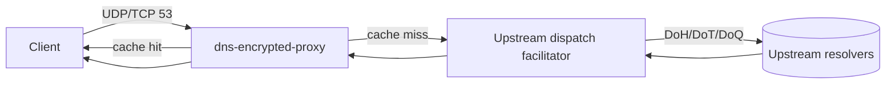
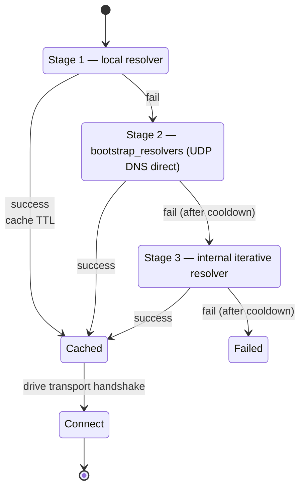
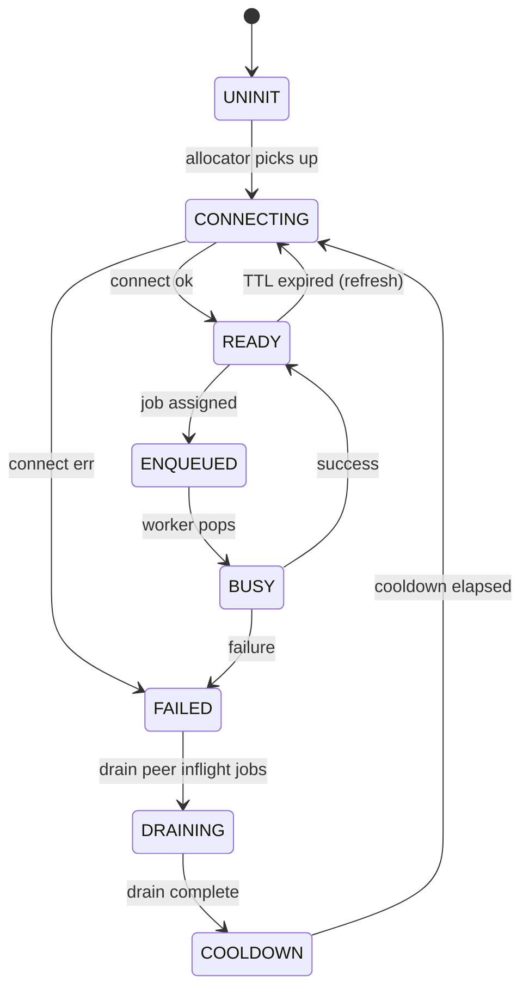

# dns-encrypted-proxy — Operations Manual

This is the engineering-grade reference for operating dns-encrypted-proxy. The README covers what it is and how to start it; the manual covers how it actually behaves once it's running, what every dial does, and how to diagnose it when it doesn't.

---

## 1. What it does

dns-encrypted-proxy is a forward DNS proxy. It listens on UDP/53 and TCP/53 for classic plaintext DNS, looks up answers in a local cache, and on cache miss forwards the question to one or more encrypted upstream resolvers (DoH, DoT, or DoQ). Responses are cached by canonical question key, the response transaction ID is rewritten to match the client's, and the answer goes back over whichever transport the client used.



Three transports are wired up. DoH is enabled by default; DoT is enabled by default; DoQ is opt-in (build flag) and currently labelled experimental.

---

## 2. Build matrix

The default Release build is what production runs. Other variants exist for specific concerns.

| Variant | Configure | Purpose |
|---|---|---|
| Release | `-DCMAKE_BUILD_TYPE=Release` | Production. `-O3 -flto`, hardened. |
| Debug | `-DCMAKE_BUILD_TYPE=Debug` | `-Og -g`, useful with gdb. |
| ASAN | `-DCMAKE_BUILD_TYPE=Debug -DENABLE_ASAN=ON` | AddressSanitizer for memory bugs. |
| Coverage | `-DENABLE_COVERAGE=ON` | gcov instrumentation, drives the `coverage` target. |
| Analyze | `-DENABLE_ANALYZER=ON -DENABLE_STACK_USAGE_CHECK=ON` | `gcc -fanalyzer` on production sources, emits `.su` files. |

Per-protocol toggles: `-DENABLE_UPSTREAM_DOH=ON|OFF`, `-DENABLE_UPSTREAM_DOT=ON|OFF`, `-DENABLE_UPSTREAM_DOQ=ON|OFF`. At least one must be on.

All ready-to-run binaries land in `build/bin/` regardless of variant — last build wins.

---

## 3. Configuration

Config is read from a file (TOML/INI-style `key = value`) at startup. Lookup order:

1. Path passed as the only positional arg: `dns-encrypted-proxy /etc/proxy.conf`
2. `DNS_ENCRYPTED_PROXY_CONFIG` env var
3. `dns-encrypted-proxy.conf` in the current working directory

Every key has an env-var override (uppercased, see column 4 below). Env vars win over file values.

### 3.1 Listener

| Key | Default | Unit | Env override | Notes |
|---|---|---|---|---|
| `listen_addr` | `0.0.0.0` | IPv4 | `LISTEN_ADDR` | Bind address. |
| `listen_port` | `53` | port | `LISTEN_PORT` | Privileged ports need `cap_net_bind_service` or root. |
| `tcp_idle_timeout_ms` | `10000` | ms | `TCP_IDLE_TIMEOUT_MS` | Idle TCP connections close after this. |
| `tcp_max_clients` | `256` | count | `TCP_MAX_CLIENTS` | Concurrent TCP connection cap. |
| `tcp_max_queries_per_conn` | `0` | count | `TCP_MAX_QUERIES_PER_CONN` | `0` = unlimited. |

### 3.2 Upstream

| Key | Default | Unit | Env override | Notes |
|---|---|---|---|---|
| `upstreams` | `https://dns.google/dns-query, https://cloudflare-dns.com/dns-query` | comma-separated URLs | `UPSTREAMS` | Schemes: `https://` (DoH), `tls://` (DoT), `quic://` (DoQ). |
| `upstream_timeout_ms` | `2500` | ms | `UPSTREAM_TIMEOUT_MS` | Per-query budget across all retries. |
| `upstream_pool_size` | `6` | count | `UPSTREAM_POOL_SIZE` | Worker slots per provider. |
| `max_inflight_doh` | `4` | count | `MAX_INFLIGHT_DOH` | Per-member concurrent DoH limit. |
| `max_inflight_dot` | `1` | count | `MAX_INFLIGHT_DOT` | Per-member concurrent DoT limit (TLS connection reuse means 1 is the right default). |
| `max_inflight_doq` | `1` | count | `MAX_INFLIGHT_DOQ` | Per-member concurrent DoQ limit. |
| `bootstrap_resolvers` | `8.8.8.8, 1.1.1.1` | comma-separated IPv4 | `BOOTSTRAP_RESOLVERS` | Stage-2 fallback recursive resolvers (see §4.2). |

### 3.3 Cache

| Key | Default | Unit | Env override | Notes |
|---|---|---|---|---|
| `cache_capacity` | `1024` | entries | `CACHE_CAPACITY` | Hash-bucketed LRU cache. |
| `hosts_a` | (empty) | comma-separated `name=ipv4` or `name:ipv4` | `HOSTS_A` | Local A-record overrides, returned with TTL 60. |

### 3.4 Metrics & logging

| Key | Default | Unit | Env override | Notes |
|---|---|---|---|---|
| `metrics_enabled` | `1` | bool | `METRICS_ENABLED` | `0` disables the metrics server. |
| `metrics_port` | `9090` | port | `METRICS_PORT` | HTTP endpoint, separate from DNS port. |
| `log_level` | `INFO` | DEBUG/INFO/WARN/ERROR | `LOG_LEVEL` | Lower is more verbose. |

---

## 4. Operating model

### 4.1 Query lifecycle

1. Client sends a DNS query over UDP or TCP.
2. The proxy parses the question section and computes a canonical key (lowercased name + qtype + qclass + EDNS-relevant flags).
3. **`hosts_a` shortcut.** If the question is a single `A IN` record matching a local hosts override, return a synthesized response with TTL 60. No upstream traffic.
4. **Cache lookup.** On hit, the cached response is returned with TTLs aged down by elapsed time.
5. **Upstream dispatch.** On miss, a job is enqueued in the dispatch facilitator with the per-query deadline (`upstream_timeout_ms`).
6. **Worker execution.** A member worker picks up the job, performs the encrypted-DNS round trip, and pushes the result to the completed queue.
7. **Completion.** The completion thread updates member state (success / failure / drain), retries on the next provider if appropriate (subject to budget and attempts), and finalizes the job.
8. **Response shaping.** ID is rewritten to match the client's. UDP responses larger than the negotiated payload limit are returned with `TC=1` so the client retries over TCP.
9. **Cache store.** Cacheable responses (NOERROR with answers, NXDOMAIN, NODATA per RFC 2308) are stored with TTL = `min(answer TTLs)` floored and capped.

### 4.2 Three-stage upstream bootstrap

DNS over an encrypted transport requires resolving the upstream's hostname first — a chicken-and-egg problem. The proxy handles it in three stages, escalating only on failure of the previous one.



- **Stage 1** (`upstream_bootstrap_stage1_hydrate`): use the OS resolver via `getaddrinfo`. Caches the result with its own TTL. Invalidated on transport failure that smells DNS-related.
- **Stage 2** (`upstream_bootstrap_try_stage2`): direct UDP DNS query to each `bootstrap_resolvers` entry in order. Cooldown `UPSTREAM_STAGE3_RETRY_COOLDOWN_MS` (30s) between stage-2 retries to avoid hammering the operator-configured resolvers.
- **Stage 3** (`upstream_bootstrap_try_stage3`): the proxy's own iterative resolver walks from the root servers down. Used only when stage 2 also fails. Same cooldown applies.

Each stage transitions are visible via the `dns_encrypted_proxy_upstream_stage_fallback_total` and `dns_encrypted_proxy_upstream_stage_reason_total` counters (see §5.5).

### 4.3 Member state machine

A *member* is one worker slot for a specific upstream provider. The proxy keeps `upstream_pool_size` members per upstream and walks each through this state machine.



- `UNINIT` — slot exists but no resources yet.
- `CONNECTING` — allocator thread is performing the handshake (DoH curl handle setup, DoT TLS handshake, DoQ QUIC handshake).
- `READY` — handshake done; member can accept jobs.
- `ENQUEUED` — at least one job is on this member's queue.
- `BUSY` — worker thread is currently performing a round trip.
- `FAILED` — last operation failed; member is being torn down.
- `DRAINING` — completion thread is fast-failing this member's other inflight jobs (real bug fix: workers actively processing a job are skipped — see `inflight_drain_member`).
- `COOLDOWN` — `MEMBER_FAILURE_COOLDOWN_MS` (default in source) before the allocator re-tries.

Per-state counts are exported as `dns_encrypted_proxy_upstream_dispatch_members{state="..."}`.

### 4.4 Cache policy

- **Hash + LRU + admission.** Each shard is a fixed-bucket hash table with a per-shard LRU list. An admission filter (`admit_bits`) avoids one-hit-wonders polluting the cache.
- **Sharding.** Multiple shards reduce mutex contention; one mutex per shard, hash determines target.
- **TTL.** Stored TTL is the minimum of the response's answer TTLs, floored at 1s and capped at the cache's hard ceiling (defined in `cache.c`). Aged down on read.
- **Bounded sweeps.** Eviction walks at most a small fixed window per insert to keep the hot path predictable.
- **Stats.** `dns_encrypted_proxy_cache_{hits,misses,evictions,expirations,entries,bytes_in_use}` and `_capacity`.

### 4.5 Protocol selection (DoH HTTP version)

When `libcurl` is built with HTTP/3, DoH requests prefer h3, then h2, then h1.1. The proxy actively probes upgrades and tracks per-upstream "forced tier" state with backoff so a flaky h3 path doesn't keep failing first on every query:

- On transport failure at a higher tier, the upstream is forced down (h3→h2 or h2→h1) for `DOH_UPGRADE_BACKOFF_BASE_MS` × `2^attempts` (capped at `DOH_UPGRADE_BACKOFF_MAX_MS`).
- After backoff, an upgrade probe goes back to the higher tier. Probe outcomes are tracked separately in counters.
- The active forced tier is exported per-upstream as `dns_encrypted_proxy_upstream_doh_forced_http_tier{...} 0|1|2` (h3/h2/h1).

Test override: setting `DNS_ENCRYPTED_PROXY_TEST_FORCE_HTTP1=1` forces h1.1 — used by integration tests; not for production.

---

## 5. Metrics reference

Endpoint: `GET /metrics` on `metrics_port`. Prometheus text format `0.0.4`. Health probes: `/healthz` (always-200 once `proxy_server_init` completes) and `/readyz` (200 once at least one member reaches `READY`).

### 5.1 Traffic

| Metric | Type | Labels | Notes |
|---|---|---|---|
| `dns_encrypted_proxy_queries_udp_total` | counter | — | Inbound UDP queries seen. |
| `dns_encrypted_proxy_queries_tcp_total` | counter | — | Inbound TCP queries (each query, not each connection). |
| `dns_encrypted_proxy_responses_total` | counter | — | Responses sent back to clients. |
| `dns_encrypted_proxy_responses_rcode_total` | counter | `rcode` | Response code histogram. |
| `dns_encrypted_proxy_truncated_sent_total` | counter | — | UDP responses with `TC=1`. |
| `dns_encrypted_proxy_servfail_sent_total` | counter | — | SERVFAIL responses (proxy-originated). |

### 5.2 Cache

| Metric | Type | Notes |
|---|---|---|
| `dns_encrypted_proxy_cache_hits_total` | counter | |
| `dns_encrypted_proxy_cache_misses_total` | counter | |
| `dns_encrypted_proxy_cache_evictions_total` | counter | LRU pressure events. |
| `dns_encrypted_proxy_cache_expirations_total` | counter | TTL-aged-out reads/sweeps. |
| `dns_encrypted_proxy_cache_entries` | gauge | Current entry count. |
| `dns_encrypted_proxy_cache_capacity` | gauge | Configured maximum. |
| `dns_encrypted_proxy_cache_bytes_in_use` | gauge | Total response bytes held. |

### 5.3 Upstream health

| Metric | Type | Labels | Notes |
|---|---|---|---|
| `dns_encrypted_proxy_upstream_success_total` | counter | — | Successful upstream queries. |
| `dns_encrypted_proxy_upstream_failures_total` | counter | — | Failed upstream queries (after retries). |
| `dns_encrypted_proxy_upstream_server_requests_total` | counter | `host`, `type` | Per-upstream requests attempted. |
| `dns_encrypted_proxy_upstream_server_failures_total` | counter | `host`, `type` | Per-upstream failures. |
| `dns_encrypted_proxy_upstream_server_healthy` | gauge | `host`, `type` | 1 healthy / 0 unhealthy. |
| `dns_encrypted_proxy_upstream_server_consecutive_failures` | gauge | `host`, `type` | Trips `0` on success. |
| `dns_encrypted_proxy_upstream_pool_capacity` | gauge | `type` | Per-protocol pool size. |
| `dns_encrypted_proxy_upstream_pool_in_use` | gauge | `type` | Active connections. |
| `dns_encrypted_proxy_upstream_pool_idle` | gauge | `type` | Available connections. |
| `dns_encrypted_proxy_upstream_connections_alive` | gauge | `type` | Established but maybe idle. |

### 5.4 DoH protocol behavior

| Metric | Type | Labels | Notes |
|---|---|---|---|
| `dns_encrypted_proxy_doh_http_responses_total` | counter | `http_version` | h3 / h2 / h1 / other. |
| `dns_encrypted_proxy_doh_protocol_downgrades_total` | counter | `from`, `to` | Forced downgrades on failure. |
| `dns_encrypted_proxy_doh_protocol_upgrade_probes_total` | counter | `result` | Upgrade probe outcome. |
| `dns_encrypted_proxy_upstream_doh_forced_http_tier` | gauge | `host` | Currently forced tier (0=h3, 1=h2, 2=h1). |
| `dns_encrypted_proxy_upstream_doh_upgrade_retry_remaining_milliseconds` | gauge | `host` | Time until next upgrade probe. |

### 5.5 Bootstrap stages

| Metric | Type | Labels | Notes |
|---|---|---|---|
| `dns_encrypted_proxy_upstream_stage` | gauge | `host`, `stage` | Active stage per upstream (1/2/3). |
| `dns_encrypted_proxy_upstream_stage_fallback_total` | counter | `from`, `to` | Stage transition events. |
| `dns_encrypted_proxy_upstream_stage_reason_total` | counter | `stage`, `reason` | Why each fallback fired (network/dns/transport/cooldown/other). |

### 5.6 Dispatch facilitator

| Metric | Type | Labels | Notes |
|---|---|---|---|
| `dns_encrypted_proxy_upstream_dispatch_queue_depth` | gauge | `queue` | submit / work / completed depths. |
| `dns_encrypted_proxy_upstream_dispatch_members` | gauge | `state` | Members in each state (§4.3). |
| `dns_encrypted_proxy_upstream_dispatch_inflight` | gauge | `provider` | Inflight job count per provider. |
| `dns_encrypted_proxy_upstream_dispatch_penalty` | gauge | `provider` | Routing penalty applied to flaky providers. |
| `dns_encrypted_proxy_upstream_dispatch_events_total` | counter | `event` | requeue / drop / budget_exhausted. |
| `dns_encrypted_proxy_upstream_dispatch_queue_wait_milliseconds_avg` | gauge | — | Rolling avg job-queue wait. |
| `dns_encrypted_proxy_upstream_dispatch_queue_wait_milliseconds_max` | gauge | — | Worst observed wait since boot. |
| `dns_encrypted_proxy_upstream_dispatch_queue_wait_bucket` | counter | `le` | Histogram (1, 5, 10, 25, 50, 100, 250, 500, 1000, +Inf ms). |

### 5.7 TCP & process

| Metric | Type | Notes |
|---|---|---|
| `dns_encrypted_proxy_tcp_connections_total` | counter | Accepted lifetime count. |
| `dns_encrypted_proxy_tcp_connections_active` | gauge | Currently held. |
| `dns_encrypted_proxy_tcp_connections_rejected_total` | counter | Bumped against `tcp_max_clients` cap. |
| `dns_encrypted_proxy_metrics_http_requests_total` | counter | Hits on the metrics server itself. |
| `dns_encrypted_proxy_metrics_http_responses_total` | counter | Status-coded responses. |
| `dns_encrypted_proxy_metrics_http_in_flight` | gauge | Concurrent metrics scrapes. |
| `dns_encrypted_proxy_process_cpu_percent` | gauge | RSS-based estimate. |
| `dns_encrypted_proxy_process_memory_rss_bytes` | gauge | From /proc/self/status. |
| `dns_encrypted_proxy_uptime_seconds` | counter | Since `proxy_server_init`. |
| `dns_encrypted_proxy_internal_errors_total` | counter | Sum of internal error events (one row per `reason` label). |

---

## 6. Deployment

### 6.1 Capabilities

Binding to UDP/TCP `:53` requires either `root` or the binary having `cap_net_bind_service`:

```bash
sudo setcap 'cap_net_bind_service=+ep' /path/to/dns-encrypted-proxy
```

The metrics port (default `9090`) is unprivileged.

### 6.2 Docker

The shipped Dockerfile builds with DoH+DoT (no DoQ) for size/portability. Default config path inside the container is `/app/config/dns-encrypted-proxy.conf` via the `DNS_ENCRYPTED_PROXY_CONFIG` env var. Mount your own config there to override.

```bash
docker run --rm -p 53:53/udp -p 53:53/tcp -p 9090:9090 \
  -v "$(pwd)/dns-encrypted-proxy.conf:/app/config/dns-encrypted-proxy.conf:ro" \
  dns-encrypted-proxy:dev
```

The container listens on `:53` inside; the host port mapping needs to be unprivileged on the host or run as root.

### 6.3 systemd unit (sketch)

```
[Service]
ExecStart=/usr/local/bin/dns-encrypted-proxy /etc/dns-encrypted-proxy.conf
AmbientCapabilities=CAP_NET_BIND_SERVICE
NoNewPrivileges=true
ProtectSystem=strict
ProtectHome=true
PrivateTmp=true
RestrictAddressFamilies=AF_INET AF_UNIX
Restart=on-failure
```

---

## 7. Troubleshooting

### 7.1 "All queries SERVFAIL"

1. `curl http://localhost:9090/readyz` — does at least one member report ready?
2. Check `dns_encrypted_proxy_upstream_stage{host="..."}` per upstream. Stuck on stage 2 or 3 means stage 1 (system DNS) is broken — check `/etc/resolv.conf` and that `bootstrap_resolvers` is reachable.
3. Check `dns_encrypted_proxy_upstream_server_consecutive_failures`. Non-zero means the upstream is rejecting / TLS failing.
4. Bump `log_level` to `DEBUG` and look for `Upstream stage event:` lines — they're verbose but explicit about which transport stage failed and why.

### 7.2 "DoH is slow / timing out"

1. `dns_encrypted_proxy_upstream_doh_forced_http_tier{host="..."}` — if it's `2` (h1) the proxy gave up on h2/h3 due to repeated failures. `dns_encrypted_proxy_upstream_doh_upgrade_retry_remaining_milliseconds` shows when the next upgrade probe will fire.
2. Check the libcurl version's HTTP/3 support: `curl -V` looking for `HTTP3` in features. Without it the proxy will run h2/h1 only — performance is fine but not the best case.
3. `dns_encrypted_proxy_upstream_dispatch_queue_wait_milliseconds_max` — high values mean dispatch is queuing rather than executing; raise `upstream_pool_size` or `max_inflight_doh`.

### 7.3 "Cache isn't helping"

1. `dns_encrypted_proxy_cache_hits_total` / `(hits + misses)` is your hit ratio. Production ratios above 40% are typical for residential traffic, lower for forwarder-of-forwarders deployments.
2. `dns_encrypted_proxy_cache_evictions_total` rising fast → bump `cache_capacity`.
3. `dns_encrypted_proxy_cache_expirations_total` rising fast with low hits → upstream TTLs are too short for the working set; not much you can do beyond capacity.

### 7.4 "Process keeps growing in memory"

`dns_encrypted_proxy_process_memory_rss_bytes` should stabilize. If it grows monotonically:

1. Compare with `dns_encrypted_proxy_cache_bytes_in_use` — usually accounts for most of it.
2. Run an ASAN build (`-DENABLE_ASAN=ON`) and reproduce. ASAN catches leaks at exit.

### 7.5 "Tests pass but I don't trust them"

The reverse-engineering moves: build with ASAN (`build/asan`), run `ctest --test-dir build/asan`. If green, run full Alpine matrix locally:

```bash
sh tools/run_ci_tests_docker.sh
```

This is the same script CI runs — it builds all 7 DoH/DoT/DoQ combinations and runs tests against each.

---

## 8. Source layout

| File | Purpose |
|---|---|
| `src/main.c` | Argv parsing, signal handlers, lifecycle. |
| `src/config.c` | Config file + env var loader. |
| `src/dns_server.c` | UDP/TCP listeners, per-query state machine, response shaping. |
| `src/dns_message.c` | DNS wire-format helpers (parse questions, validate responses, age TTLs). |
| `src/cache.c` | Sharded TTL-aware LRU cache. |
| `src/upstream.c` | Upstream client orchestrator, cross-protocol fallback. |
| `src/upstream_dispatch.c` | Allocator, dispatcher, completion threads; the per-member state machine. |
| `src/upstream_bootstrap.c` | 3-stage bootstrap. |
| `src/upstream_doh.c` / `.h` | libcurl-based DoH transport. |
| `src/upstream_dot.c` / `.h` | OpenSSL-based DoT transport. |
| `src/upstream_doq.c` / `.h` | DoQ frontend, delegates to `upstream_doq_ngtcp2`. |
| `src/upstream_doq_ngtcp2.c` / `.h` | ngtcp2-based DoQ transport. |
| `src/iterative_resolver.c` | Stage-3 resolver (root → TLD → authoritative). |
| `src/metrics.c` | Prometheus exposition + `/healthz` / `/readyz`. |
| `src/logger.c` | Thin wrapper over the c-log dependency. |

Dependencies that have to be present at build time:

- `c-log` (header-only, the project's own structured logger; path via `-DC_LOG_PATH`).
- `libcurl` if `ENABLE_UPSTREAM_DOH=ON`.
- `openssl` if `ENABLE_UPSTREAM_DOT=ON` or `ENABLE_UPSTREAM_DOQ=ON`.
- `ngtcp2` + an ngtcp2 OpenSSL-family crypto module if `ENABLE_UPSTREAM_DOQ=ON`.
- `cmocka` if `BUILD_TESTS=ON`.
- `gcovr` if `ENABLE_COVERAGE=ON` and you want the `coverage` target.
- `clang-tidy` and `cppcheck` for the `lint` and `cppcheck` targets respectively.
